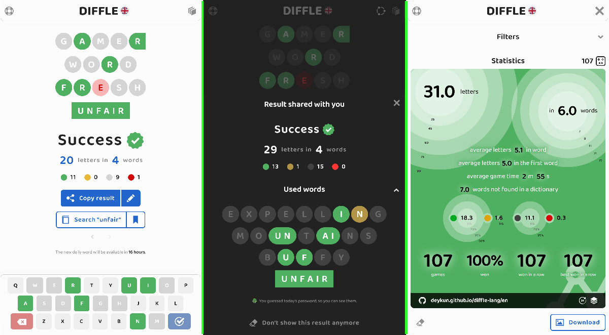

React, Vite, TypeScript, Redux Toolkit, Playwright

# 🕹️ DIFFLE-LANG - word game

A Wordle-like game without a character limit, where every used word gives hints about the position and order of letters in the solution.

The website: https://deykun.github.io/diffle-lang/

Supported languages:
- **Czech** since 02.02.2024 🇨🇿
- **English** since 19.01.2024 🇬🇧
- **Finnish** since 28.07.2024 🇫🇮
- **French** since 02.03.2024 🇫🇷
- **Italian** since 15.05.2024 🇮🇹
- **Polish** since 30.07.2023 🇵🇱
- **Spanish** since 21.02.2024 🇪🇸
- **German** since 19.02.2024 🇩🇪

### Report a translation bug
https://crowdin.com/project/diffle-lang

# App screenshots

### Polskie DIFFLE 🇵🇱
DIFFLE gra jak Wordle (po polsku, bez limitu znaków), każde użyte słowo podpowiada pozycję i kolejność liter w haśle.

Największa polska społeczność: https://www.hejto.pl/tag/diffle

# Cool features ✨

### Spellchecker API
This project is 100% GitHub-hosted, so it doesn't have a backend server. The spellchecker dictionary is usually over 45MB. In this repository, the dictionary is divided into thousands of JSON files. When someone searches for "łódź", the word is converted to "lodz", limited to 3 characters, and pl/chunk-lod.json is fetched to check if it's there. It's a lightweight, quick, and serverless-like solution.

### About language 
This app has a dedicated subpage with a meta-analysis of the dictionary, including information on the most common letters, length of words, etc.

- https://deykun.github.io/diffle-lang/cs?p=about-language 🇨🇿 
- https://deykun.github.io/diffle-lang/de?p=about-language 🇩🇪 
- https://deykun.github.io/diffle-lang/en?p=about-language 🇬🇧
- https://deykun.github.io/diffle-lang/es?p=about-language 🇪🇸
- https://deykun.github.io/diffle-lang/fi?p=about-language 🇫🇮
- https://deykun.github.io/diffle-lang/fr?p=about-language 🇫🇷
- https://deykun.github.io/diffle-lang/it?p=about-language 🇮🇹
- https://deykun.github.io/diffle-lang/pl?p=about-language 🇵🇱

### A reactive keyboard
I challenge you to find a better keyboard in any Wordle game. This keyboard reacts and provides hints while typing, with optional vibrations (which are longer when an incorrect letter is typed).

### Spoiler-Free sharing
You can share your result with a hashed URL, which after winning your daily game will display the words from the result.

# Resources 🗃️

### Original DIFFLE
 - https://hedalu244.github.io/diffle/ 🟢
 - https://github.com/hedalu244/diffle

### Dictionaries
[Check 📔 DICTIONARIES.md](DICTIONARIES.md)

### Other
 - https://iconmonstr.com/ - icons
 - https://github.com/lipis/flag-icons - flags
